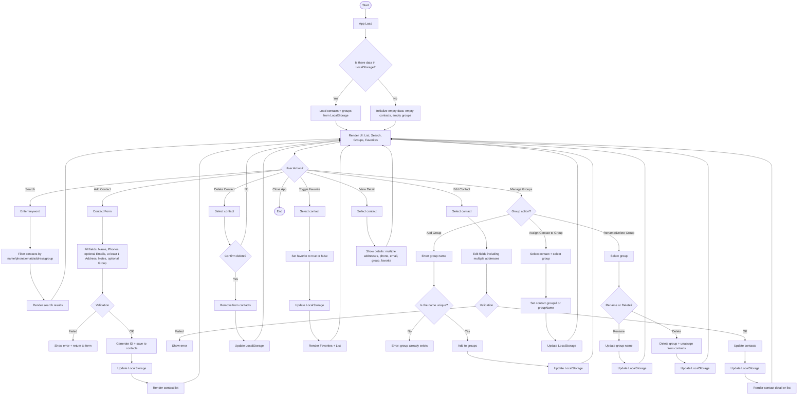

# Address Book / Contacts (LocalStorage)

A simple **web-based Address Book / Contacts** app (no backend) that stores and manages contacts directly in the browser using **LocalStorage**.

## Features

- ✅ **Add / Edit / Delete contacts**
- ✅ **Search** contacts (by name/phone/email/address/group)
- ✅ **Favorites** (mark/unmark contacts as favorite)
- ✅ **Groups** (create groups and assign contacts to groups)
- ✅ **Multiple addresses** (one contact can have more than one address)
- ✅ **Persistent storage via LocalStorage** (data remains after refresh)

---

## Project Structure

/project-root
├─ index.html
├─ index.css
└─ index.js

---

## Getting Started

### Option 1 — Open directly
1. Download / clone the project
2. Open `index.html` in your browser (Chrome/Firefox/Edge)

### Option 2 — Use a local server (recommended)
If you use VS Code:
- Install **Live Server** extension
- Right-click `index.html` → **Open with Live Server**

Or using Node:
```bash
npx serve .
```

## How to Use

### Add a Contact
- Fill the form (name + at least 1 address)
- Add phone/email (optional)
- Click Save

### Search
- Type a keyword into the search input
- The list filters by name, phone, email, address, group.

### Favorites
- Click the favorite button/icon on a contact (toggle ON/OFF)
- Favorite contacts appear in a Favorites section/tab (if implemented)

### Groups
- Create a new group (group name must be unique)
- Assign a contact to a group
- Rename/Delete groups (contacts will be unassigned if the group is deleted)

### Multiple Addresses
- In the contact form, you can add more than one address
- Edit a contact to add/remove existing addresses

### Data Storage (LocalStorage)
- The app stores data as JSON strings in LocalStorage.

### Storage Keys
- contacts
- groups

### Example Data Models
#### Contact

```json
{
  "id": "c_1700000000000",
  "name": "John Doe",
  "phones": ["+628123456789"],
  "emails": ["john@example.com"],
  "addresses": [
    "Street A No. 1, Jakarta",
    "Street B No. 2, Depok"
  ],
  "groupId": "g_1699999999999",
  "favorite": true,
  "notes": "Work friend"
}
```

### Group

```json
{
  "id": "g_1699999999999",
  "name": "Work"
}
```

### Validation Rules
- name, phone is required
- email are optional (validate format if provided)
- addresses must contain at least 1 non-empty entry
- group names must be unique

### Flowchart

